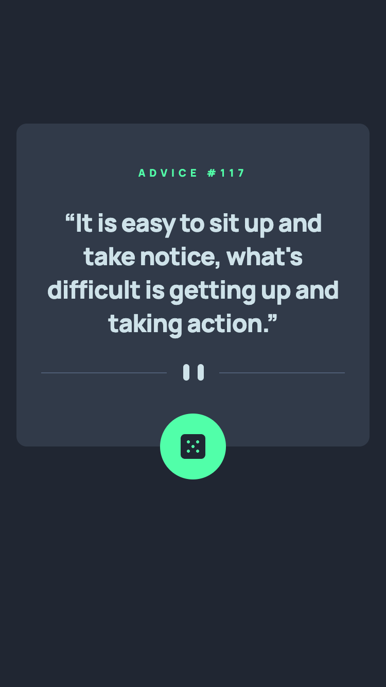
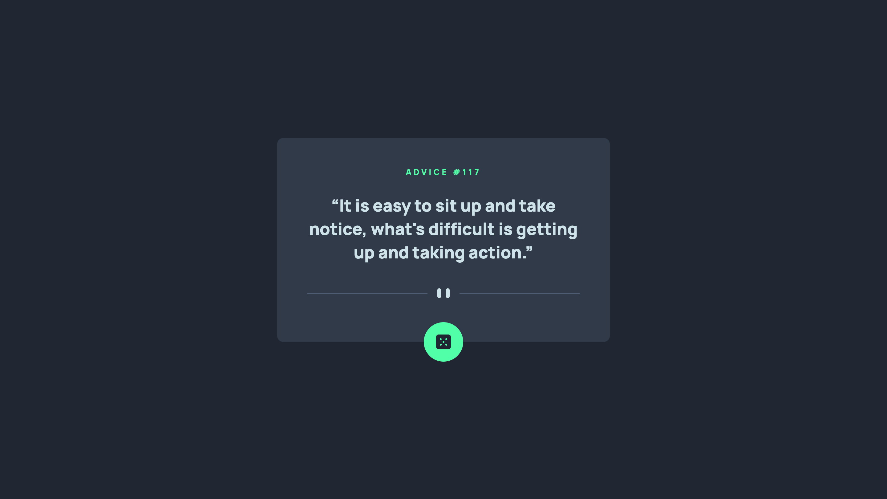

# Frontend Mentor - Advice generator app solution

This is a solution to the [Advice generator app challenge on Frontend Mentor](https://www.frontendmentor.io/challenges/advice-generator-app-QdUG-13db). Frontend Mentor challenges help you improve your coding skills by building realistic projects.

## Table of contents

- [Overview](#overview)
  - [The challenge](#the-challenge)
  - [Screenshot](#screenshot)
  - [Links](#links)
- [My process](#my-process)
  - [Built with](#built-with)
  - [What I learned](#what-i-learned)
  - [Continued development](#continued-development)
  - [Useful resources](#useful-resources)
- [Author](#author)

**Note: Delete this note and update the table of contents based on what sections you keep.**

## Overview

### The challenge

Users should be able to:

- View the optimal layout for the app depending on their device's screen size
- See hover states for all interactive elements on the page
- Generate a new piece of advice by clicking the dice icon

### Screenshot

|  Mobile designed at 375px:   |  Desktop designed at 1440px:  |
| :--------------------------: | :---------------------------: |
|  |  |

### Links

- Solution URL: [https://github.com/elisilk/advice-generator-app-main](https://github.com/elisilk/advice-generator-app-main)
- Live Site URL: [https://elisilk.github.io/advice-generator-app-main/](https://elisilk.github.io/advice-generator-app-main/)

## My process

### Built with

- Semantic HTML5 markup
- CSS custom properties
- Flexbox
- Mobile-first workflow
- Javascript API data import using fetch

### What I learned

- [Using an API](https://api.adviceslip.com/) - Was a ton of fun to do my first challenge with using an API. I loved working out [how to use fetch](https://developer.mozilla.org/en-US/docs/Web/API/Fetch_API/Using_Fetch) and play around with using a [third-party API](https://developer.mozilla.org/en-US/docs/Learn/JavaScript/Client-side_web_APIs/Third_party_APIs) in JavaScript.
- [Absolutely positioning elements](https://stackoverflow.com/questions/10487292/position-absolute-but-relative-to-parent) - This was the clearest explanation for me about the relationship between the child element that I want to position absolutely and its parent container.
- [Using the transform translate property](https://developer.mozilla.org/en-US/docs/Web/CSS/transform-function/translate) - To position the button below the bottom edge of the container
- [Using the background property](https://developer.mozilla.org/en-US/docs/Web/CSS/background) - To position the pattern divider images at the bottom of the advice text
- [Common HTML entities used for typography](https://www.w3.org/wiki/Common_HTML_entities_used_for_typography) - I was a little confused about how to get the quotation marks looking correct, and how to use them both in HTML (as alphanumeric values/entities) and in [JavaScript (as unicode values)](https://stackoverflow.com/questions/13093126/insert-unicode-character-into-javascript).
- [Add a click event listener to an HTML element](https://developer.mozilla.org/en-US/docs/Web/API/Element/click_event#javascript) - used the JavaScript example as model for how to bind the click event listener to the HTML button
- [Flex](https://developer.mozilla.org/en-US/docs/Web/CSS/flex) - I still have to get more comfortable with Flex, especially knowing [what is the main axis and what is the cross axis](https://developer.mozilla.org/en-US/docs/Web/CSS/flex), and then how that changes to use of and behavior of the [align-\* vs. justify-\* properties](https://developer.mozilla.org/en-US/docs/Web/CSS/CSS_flexible_box_layout/Aligning_items_in_a_flex_container)
- [Creating the glow effect on the button hover/active states](https://codersblock.com/blog/creating-glow-effects-with-css/) - Uses the [box-shadow property](https://cssbud.com/css-generator/css-glow-generator/)

### Continued development

- [Checking the API string for funny characters](https://www.google.com/search?q=javascript+escape+text) - At least one of the advice text's had a special character that didn't display properly. Unfortunately, I forgot to record which one and haven't found it again yet. But when I do, I'd like to learn how to clean the text to make sure it displays well.
- [Principles of writing consistent, idiomatic CSS](https://github.com/necolas/idiomatic-css) - I used this to troubleshoot an issue that came up when I used [two forward slashes to make a one-line comment in my CSS file](https://stackoverflow.com/questions/12298890/is-it-bad-practice-to-prefix-single-lines-of-css-with-as-a-personal-comment-s), but that didn't work and messed things up. So now I'm using only [the multi-line comments (even for single lines)](https://developer.mozilla.org/en-US/docs/Web/CSS/Comments), which are the appropriate standard. But that led me to this other site that makes me want to think more carefully about how I comment and organize my CSS files more generally.
- How to get pixel perfection (or not) - I'm still struggling on getting the font size, font weight, letter spacing, and line heights to match perfectly. I got a little frustrated with how the [PerfectPixel](https://chromewebstore.google.com/detail/dkaagdgjmgdmbnecmcefdhjekcoceebi?hl=en-US) Chrome extension was working, and so decided to try an alternative, [PixelParallel](https://chromewebstore.google.com/detail/pixelparallel-by-htmlburg/iffnoibnepbcloaaagchjonfplimpkob?hl=en), which I think I like better for now. But I'll have to keep working on this, and better understand how those different elements of typography all work together. Or maybe learn to know when good enough is okay, rather than chasing pixel perfection.

### Useful resources

- [MDN Web Docs](https://developer.mozilla.org/en-US/docs/Web) - Of course, as always. So useful.

## Author

- Website - [Eli Silk](https://github.com/elisilk)
- Frontend Mentor - [@elisilk](https://www.frontendmentor.io/profile/elisilk)
